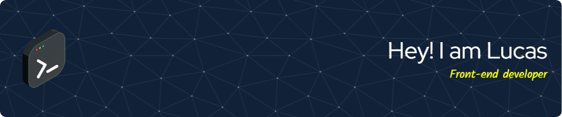

### Hi there coders 👋👨‍💻

<table align="right">
 <tr><td><a href="README.md">English</a></td></tr>
 <tr><td><a href="README_es.md">Spanish</a></td></tr>
</table>

<!--
https://github-readme-stats-lucasecapdevilas-projects.vercel.app/
**lucasecapdevila/lucasecapdevila** is a ✨ _special_ ✨ repository because its `README.md` (this file) appears on your GitHub profile.

Here are some ideas to get you started:

- 🔭 I’m currently working on ...
- 🌱 I’m currently learning ...
- 👯 I’m looking to collaborate on ...
- 🤔 I’m looking for help with ...
- 💬 Ask me about ...
- 📫 How to reach me: ...
- 😄 Pronouns: ...
- ⚡ Fun fact: ...
-->
