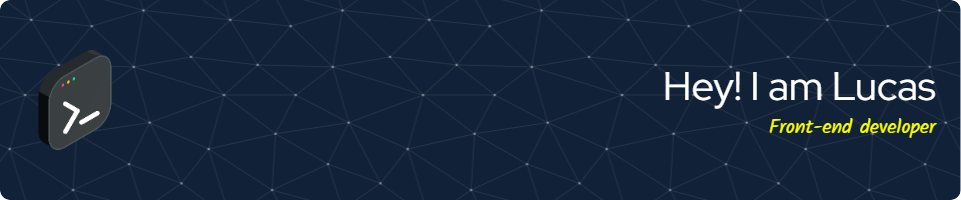

## Hi there coders 👋👨‍💻

<table align="right">
 <tr ><td><a href="README.md"> English</a></td></tr>
 <tr><td><a href="README_es.md"> Spanish</a></td></tr>
</table>

### Now Playing on Spotify 🎧

<!-- Hobbies/about/pronouns/fun fact and a GIF -->

### 💬 About 
- 👦 Pronouns: he/him/his.
- 🎧 Always listening to music.
- 🧉 Better with mates.
- 🦸 Marvel fan.
- 💻 I'm currently working on create webpages.
- 🌱 Going deeper on Javascript and React.js.
- 🤓 Fast learner and eager to explore new technologies.
- 🧐 Backend is next on my list.
- 🤝 Highly willing to team work.
- ❔ Ask me about anything, I'm happy to help !
- ⚡ Fun fact: huge fan of history 📚.

### 🛠️ Languages and tools:

 
 
 
 
 
 
 
 
 
 

### 🌱 2024 goals:

 
 
 
 
 
 
 
 
 
 

 

### 🌎 Connect with me:

### Want to Build Your Own?
Do you like my profile and want to build your own? It's very simple. GitHub has a feature called Profile Readmes. For it to work, do the following:

- Create a *special* GitHub repository with your username as repository name. My username is `lucasecapdevila` so my profile readme repository has the name `lucasecapdevila`.
- Add a `README.md` to this repository.
- Put some cool content about yourself (or anything you want) into `README.md`.
- And that's about it. The `README.md` of your profile readme repository will be displayed on your profile page.
- If you need inspiration, you can check out these repositories which contain a curated list of nice profile readme repositories:
  - [kautukkundan's repo](https://github.com/kautukkundan/Awesome-Profile-README-templates)
  - [abhisheknaiidu's repo](https://github.com/abhisheknaiidu/awesome-github-profile-readme)
